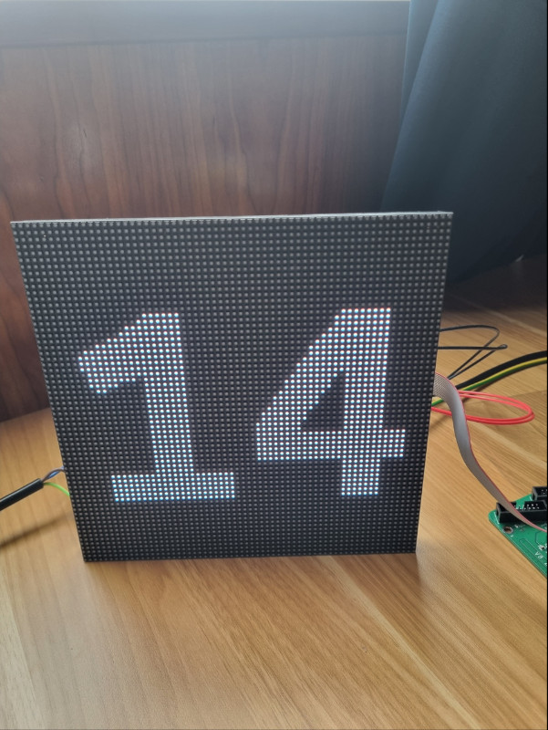

### Node-colorlight

```
yarn add node-colorlight
```

Driver to connect to colorlight 54-75B. Based on https://github.com/haraldkubota/colorlight




## How to use

Check `example` folder. You'll need sudo execution, in order to send raw frames through ethernet to the controller